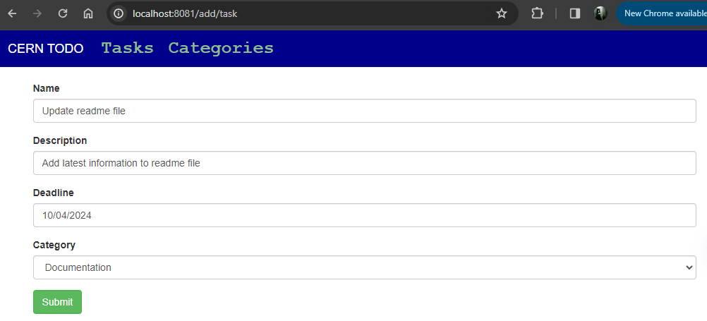
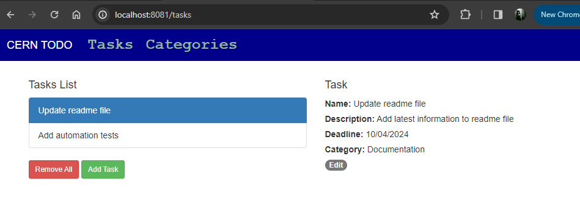
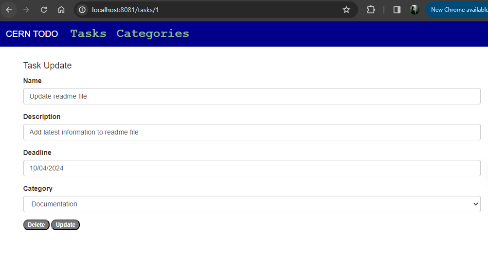
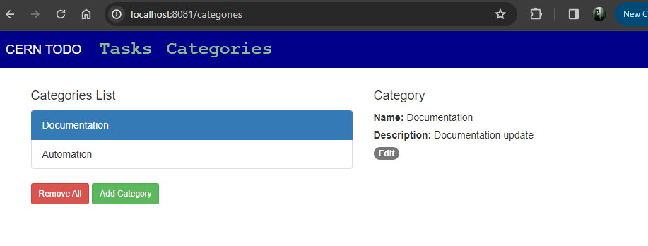

This is a simple TODO Spring Boot application which allows users to create, edit and delete TODO tasks.

Exposed endpoints:

| Methods  | Urls | Actions|
| ------------- | ------------- | ------------- |
| POST | 	/api/category |	create new Category |
| GET | 	/api/category |	retrieve all Categories |
| GET | 	/api/category/:id |	retrieve a Category by :id |
| PUT | 	/api/category/:id |	update a Category by :id |
| DELETE | 	/api/category/:id |	delete a Category by :id |
| DELETE | 	/api/category |	delete all Categories |
| GET | 	/api/category?name=[keyword] | find all Categories which name contains keyword |
| POST | 	/api/categories/:categoryId/tasks |	create new Task with :categoryId |
| GET | 	/api/tasks |	retrieve all Tasks |
| GET | 	/api/tasks/:id |	retrieve a Task by :id |
| GET | 	/api/categories/:categoryId/tasks |	retrieve a Task by :categoryId |
| PUT | 	/api/tasks/:id |	update a Task by :id |
| DELETE | 	/api/tasks/:id |	delete a Task by :id |
| DELETE | 	/api/tasks |	delete all Tasks |
| GET | 	/api/tasks?name=[keyword] | find all Tasks which name contains keyword |

Model of the DB:

The UI client is implemented using Angular and alows the user to easily interact with the Java APIs.

Add Task

List All Tasks

Task Update

Categories List

